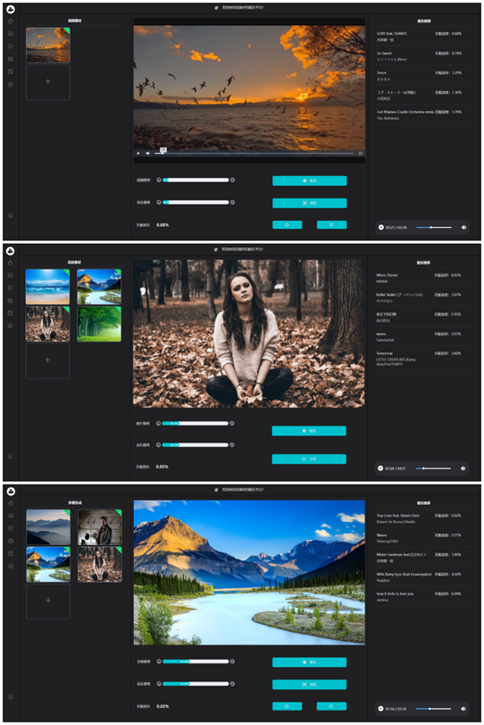
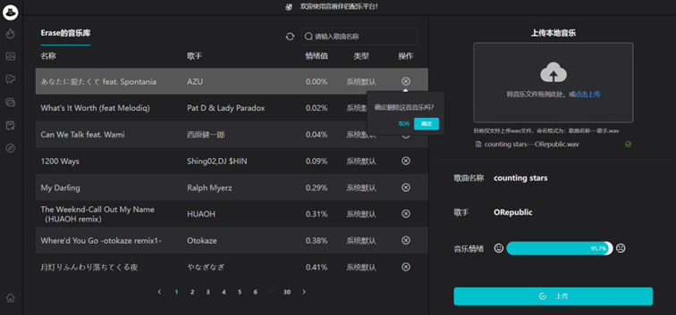
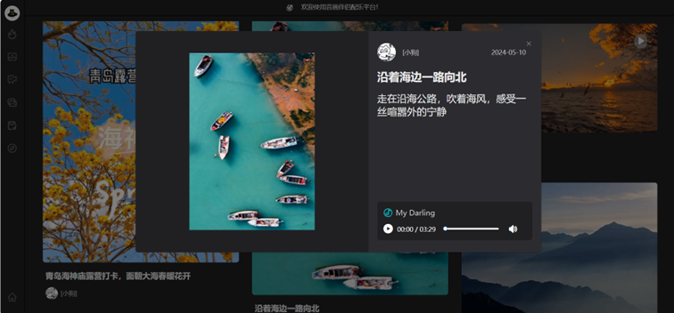
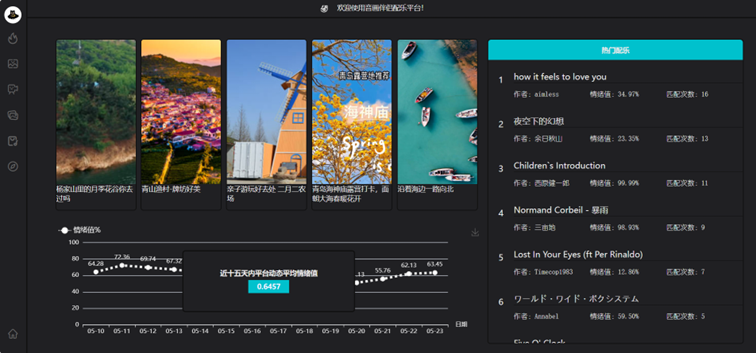

# DaYinXiSheng (大音希声) 

> **Cross-Modal Music Retrieval from Visual Content**
> *Aligning visual aesthetics with auditory emotions through Contrastive Learning.*

[](https://www.python.org/)
[](https://pytorch.org/)
[](https://spring.io/projects/spring-boot)
[](https://vuejs.org/)
[](https://www.electronjs.org/)

**DaYinXiSheng** (meaning *"The greatest sound is hard to hear"* in Chinese philosophy) is an advanced cross-modal retrieval system that bridges the gap between visual content and music through emotion-aware embeddings. By leveraging contrastive learning, the system can automatically suggest or generate music that matches the emotional resonance of images or videos.

## 🌟 Key Features

*   **Emotion-Aware Retrieval**: Achieves **92% Top-5 accuracy** on the EmoMV dataset by aligning visual and audio representations in a shared emotional latent space.
*   **Cross-Modal Alignment**: Utilizes a CLIP-style **InfoNCE loss** to synchronize a ResNet-based visual encoder with a Transformer-based audio encoder.
*   **Versatile Input Support**: Supports music retrieval from a single image, a sequence of images (multi-image), or full-length videos.
*   **Automated MV Creation**: Seamlessly integrates **OpenCV** and **FFmpeg** to generate professional-looking music videos by concatenating retrieved audio with processed visual content.
*   **Interactive Desktop Experience**: A polished **Electron + Vue** frontend providing real-time inference, emotion visualization (ECharts), and media playback.

## 🖼️ System Preview

<div align="center">
  
  
  <br>
  
  
</div>

## 🏗️ System Architecture

The project is built on a robust tri-tier architecture:

1.  **AI Inference Engine (Flask)**:
    *   **Visual Encoder**: ResNet-34 fine-tuned for emotional feature extraction.
    *   **Audio Analysis**: Transformer-based encoder and Librosa for spectral feature extraction.
    *   **Processing**: OpenCV for frame sampling and FFmpeg for high-performance media muxing.
2.  **Management Backend (Spring Boot)**:
    *   Handles metadata, user assets, and music database management.
    *   Integrates **Tencent Cloud COS** for scalable media storage and **MySQL** for relational data.
3.  **Frontend (Electron & Vue.js)**:
    *   Cross-platform desktop application for interactive retrieval and creative production.

## 🛠️ Tech Stack

| Layer | Technologies |
| :--- | :--- |
| **AI / ML** | PyTorch, Torchvision, Librosa, NumPy, Pandas |
| **Media** | OpenCV, FFmpeg, Pydub |
| **Java Backend** | Spring Boot, MyBatis-Plus, MySQL, FastJSON |
| **Frontend** | Electron, Vue 2, Element UI, ECharts, Axios |
| **Cloud** | Tencent Cloud COS (Object Storage) |

## 🚀 Getting Started

### Prerequisites
*   Python 3.8+
*   Java 8 (JDK 1.8)
*   Node.js & npm
*   FFmpeg installed in system PATH

### Installation

1.  **Clone the repository**:
    ```bash
    git clone https://github.com/your-username/DaYinXiSheng.git
    cd DaYinXiSheng
    ```

2.  **Setup AI Backend**:
    ```bash
    cd flask_template-master
    pip install -r requirements.txt
    python manage.py run
    ```

3.  **Setup Java Backend**:
    ```bash
    cd backend
    # Configure application.yml with your MySQL & Tencent COS credentials
    ./mvnw spring-boot:run
    ```

4.  **Setup Frontend**:
    ```bash
    cd front_end_new
    npm install
    npm run electron:serve
    ```

## 📊 Performance

The core model was trained using a contrastive framework to minimize the distance between positive visual-audio pairs while maximizing the distance for negative pairs.

*   **Dataset**: EmoMV (Emotion-aligned Music Video dataset)
*   **Metric**: Top-5 Retrieval Accuracy
*   **Result**: **92%**

## 📖 Usage

1.  **Upload**: Select an image or video file through the Electron interface.
2.  **Analysis**: The system extracts emotional features using the ResNet-34 encoder.
3.  **Match**: The Flask server calculates the emotional distance (`InfoNCE loss`) against the music database.
4.  **Generate**: Choose a retrieved track to automatically generate a synced MV using the built-in FFmpeg pipeline.

## 📄 License
This project is licensed under the MIT License - see the [LICENSE](LICENSE) file for details.

